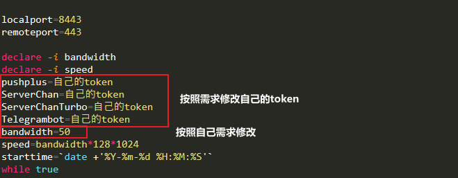
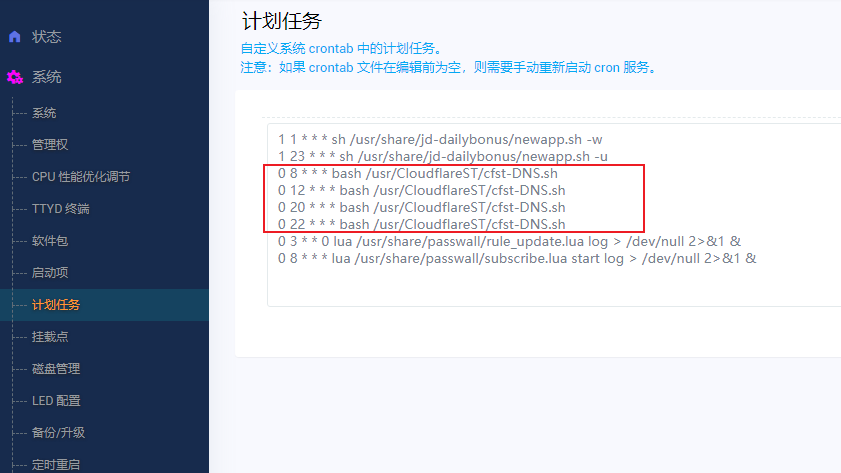

# 路由器优选IP脚本设置定时更换优选ip
* 用ssh连接软件连接opewrt
```Bash
# 进入root文件夹
cd /mnt/mmcblk2p4

# 如果是第一次使用，则建议创建新文件夹（后续更新请跳过该步骤）
mkdir CloudflareST

# 进入文件夹（后续更新，只需要从这里重复下面的下载、解压命令即可）
cd /mnt/mmcblk2p4/CloudflareST

# 下载 CloudflareST 压缩包（自行根据需求替换 URL 中版本号和文件名）
wget -N https://cdn.jsdelivr.net/gh/Lbingyi/CloudflareST@main/CloudflareST.tar.gz

# 解压（不需要删除旧文件，会直接覆盖，自行根据需求替换 文件名）
tar -zxf CloudflareST.tar.gz

# 赋予执行权限
chmod +x CloudflareST

# 首次建议手动执行命令
bash /mnt/mmcblk2p4/CloudflareST/cfst-DNS.sh
```
#### 修改cfst-DNS.sh中的一处地方

* 修改微信/Telegram推送token



* 0代表分9代表小时，意思是9：00整开始运行脚本
```Bash

0 9 * * * bash /mnt/mmcblk2p4/CloudflareST/cfst-DNS.sh
0 20 * * * bash /mnt/mmcblk2p4/CloudflareST/cfst-DNS.sh
```
* 添加计划任务
* 依次进入 系统-计划任务
* 添加一下命令



* 到这里就完成全部操作了，然后就是等待自动执行。
* 当然，我们可以手动来执行一次，执行命令：
```Bash
bash /mnt/mmcblk2p4/CloudflareST/cfst-DNS.sh
```

## 修改于CloudflareSpeedTest
* 请参考 [CloudflareSpeedTest](https://github.com/XIU2/CloudflareSpeedTest)
